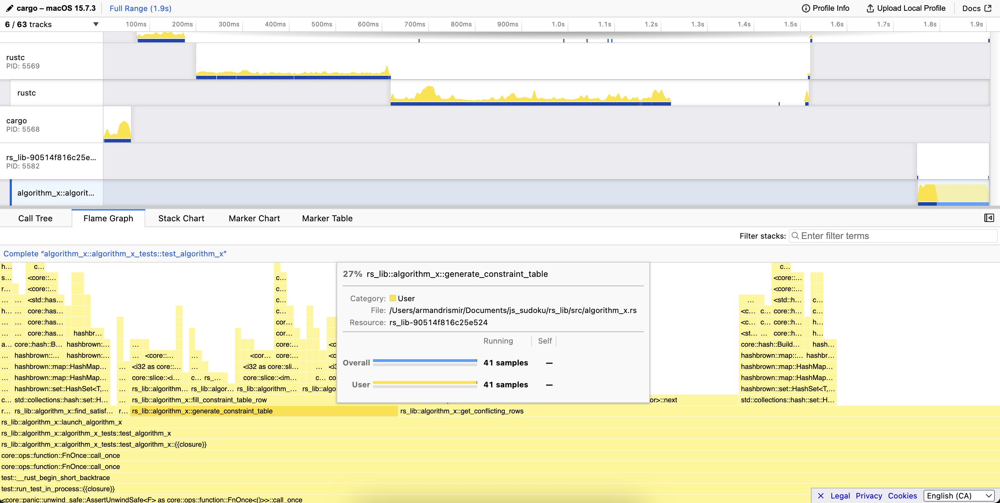

# Profiling

Samply is a super easy profilling tool. Using it is super simple. In my case
I needed to optimize a slow function and corresponding test. So it was just 
`samply record cargo test <test_name>`.

From here you get a very nice flame graph you can view in the browser. So
nice!

